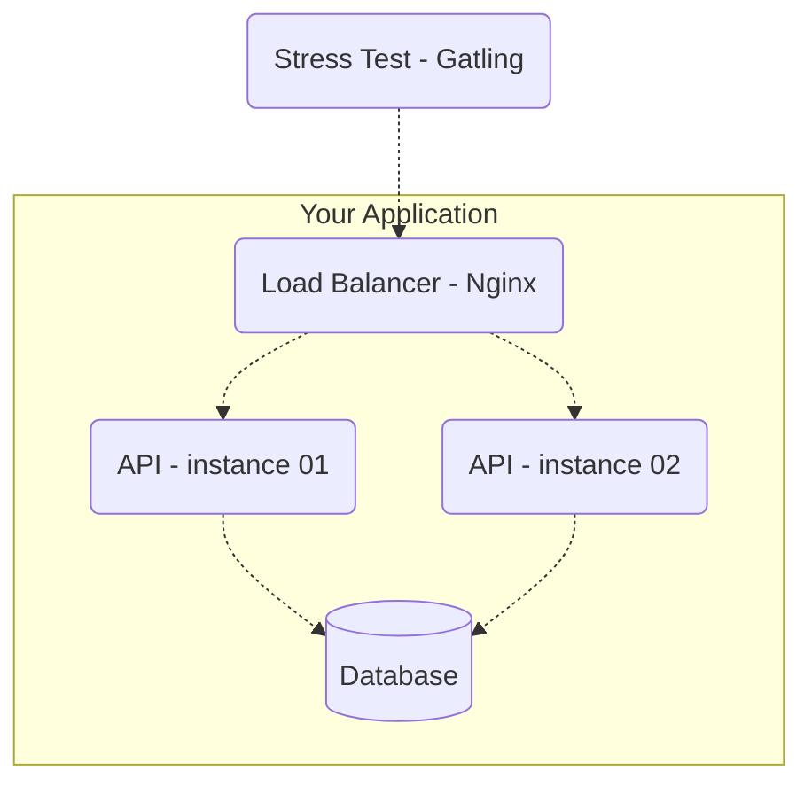

# Instructions and Rules for Backend Battle - 2023 Q3 Edition


## Summary

- The APIs must expose identical endpoints and use one of the following databases (your choice): Postgres, MySQL, or MongoDB.
- The API "deploy" will be done via docker-compose with CPU and memory limits.
- The test will be executed on a properly configured EC2 instance, and CPU and memory limitations will make the test more challenging. Be creative!
- The [Gatling](https://gatling.io/) tool will be used for stress testing.
- The essence of this tournament is not the competition itself (since the winner doesn’t actually win anything, haha), but sharing knowledge.
- Details of the stress test are [here!](/stress-test/README.md)
- You have until midnight on **22/08**, aka `2023-08-22T23:59:59-03:00`, to submit your PR. On August 25th, there will be a live stream on https://www.youtube.com/zanfranceschi to broadcast the Backend Battle live.

## Endpoints
The APIs need to expose 3 (actually 4) endpoints:

- `POST /pessoas` – to create a person resource.
- `GET /pessoas/[:id]` – to retrieve a resource created with the previous request.
- `GET /pessoas?t=[:search term]` – to search for people.
- `GET /contagem-pessoas` – special endpoint to count registered people.

### Creating People
`POST /pessoas`

It should accept a JSON request with the following parameters:

| Attribute | Description |
| --- | --- |
| **nickname** | required, unique, string up to 32 characters. |
| **name** | required, string up to 100 characters. |
| **birthdate** | required, string for the date in the format YYYY-MM-DD (year, month, day). |
| **stack** | optional, array of strings, each element being required and up to 32 characters. |

For valid requests, your API should return a status code of 201 - created, along with the header "Location: /pessoas/[:id]" where [:id] is the UUID of the person just created. The response body is up to you; return whatever you want.

Examples of valid requests:
```json
{
    "nickname" : "josé",
    "name" : "José Roberto",
    "birthdate" : "2000-10-01",
    "stack" : ["C#", "Node", "Oracle"]
}
```

```json
{
    "nickname" : "ana",
    "name" : "Ana Barbosa",
    "birthdate" : "1985-09-23",
    "stack" : null
}
```

For invalid requests, the status code must be 422 - Unprocessable Entity/Content. Again, the body content is up to you.

Examples of invalid requests:
```json
{
    "nickname" : "josé", // if "josé" was already created in another request
    "name" : "José Roberto",
    "birthdate" : "2000-10-01",
    "stack" : ["C#", "Node", "Oracle"]
}
```

```json
{
    "nickname" : "ana",
    "name" : null, // cannot be null
    "birthdate" : "1985-09-23",
    "stack" : null
}
```

For syntactically invalid requests, the response should have a status code of 400 - bad request. Examples:

```json
{
    "nickname" : "nickname",
    "name" : 1, // name must be a string, not a number
    "birthdate" : "1985-01-01",
    "stack" : null
}
```

```json
{
    "nickname" : "nickname",
    "name" : "name",
    "birthdate" : "1985-01-01",
    "stack" : [1, "PHP"] // stack must be an array of strings only
}
```

### Person Details
`GET /pessoas/[:id]`

Should return the details of a person if previously created. The [:id] parameter must be a UUID of the version you choose. The return should be like the following examples:

```json
{
    "id" : "f7379ae8-8f9b-4cd5-8221-51efe19e721b",
    "nickname" : "josé",
    "name" : "José Roberto",
    "birthdate" : "2000-10-01",
    "stack" : ["C#", "Node", "Oracle"]
}
```

```json
{
    "id" : "5ce4668c-4710-4cfb-ae5f-38988d6d49cb",
    "nickname" : "ana",
    "name" : "Ana Barbosa",
    "birthdate" : "1985-09-23",
    "stack" : null
}
```

The response is essentially the same as the creation payload, with the addition of `id`. The status code for existing people should be 200 - Ok. For non-existent resources, return 404 - Not Found.

### Searching for People
`GET /pessoas?t=[:search term]`

Given the `search term`, the response should be a list of people where the term matches the `nickname`, `name`, and/or elements of the `stack`. The search doesn’t need to be paginated and can return only the first 50 records to simplify implementation.

The status code should always be 200 - Ok, even if the search returns no results (empty).

Examples: Given the following existing resources in your application:

```json
[{
    "id" : "f7379ae8-8f9b-4cd5-8221-51efe19e721b",
    "nickname" : "josé",
    "name" : "José Roberto",
    "birthdate" : "2000-10-01",
    "stack" : ["C#", "Node", "Oracle"]
},
{
    "id" : "5ce4668c-4710-4cfb-ae5f-38988d6d49cb",
    "nickname" : "ana",
    "name" : "Ana Barbosa",
    "birthdate" : "1985-09-23",
    "stack" : ["Node", "Postgres"]
}]
```

A request to `GET /pessoas?t=node` should return:
```json
[{
    "id" : "f7379ae8-8f9b-4cd5-8221-51efe19e721b",
    "nickname" : "josé",
    "name" : "José Roberto",
    "birthdate" : "2000-10-01",
    "stack" : ["C#", "Node", "Oracle"]
},
{
    "id" : "5ce4668c-4710-4cfb-ae5f-38988d6d49cb",
    "nickname" : "ana",
    "name" : "Ana Barbosa",
    "birthdate" : "1985-09-23",
    "stack" : ["Node", "Postgres"]
}]
```

A request to `GET /pessoas?t=berto` should return:
```json
[{
    "id" : "f7379ae8-8f9b-4cd5-8221-51efe19e721b",
    "nickname" : "josé",
    "name" : "José Roberto",
    "birthdate" : "2000-10-01",
    "stack" : ["C#", "Node", "Oracle"]
}]
```

A request to `GET /pessoas?t=Python` should return:
```json
[]
```

If the query string `t` is not provided, the response should have a status code of 400 - bad request, with any body content of your choice. Providing `t` is mandatory.

### Special People Count - Special Endpoint
`GET /contagem-pessoas`

This is a special endpoint that WON’T BE TESTED (so don’t worry about its performance) and should return the number of person records in plain text, with any 2XX status code. It will be used to validate the number of successful `POST /pessoas` requests during the stress test, so don’t use cache or any eventual consistency mechanism.

### Important Note About Cache and Storage
You can use caching, but all records created through `POST /pessoas` requests must be persisted in a non-volatile storage (disk).

## Component Restrictions
The test will include the following components and topology:



### Stress Test - Gatling
The component that will execute the stress test against your application.

#### Load Balancer - Nginx
The load balancer is included in the test to simulate a production environment with more than one instance of an API for higher availability.

### API - instances 01 and 02
As mentioned, the test will be executed with two instances of your API. This setup is closer to a production environment and forces you to think more carefully

 about topics like distributed cache, idempotency of POST requests, etc. Each instance will run with a limitation of:

- **CPU**: 1 core
- **Memory**: 512MB of RAM

Since you need to run two instances simultaneously on the same machine, the final EC2 instance where the test will run has a limitation of 2 CPU cores and 1GB of memory for both instances combined.

## Requirements
### Endpoints
Ensure your API exposes the endpoints defined above and returns the correct responses.

### Deployment and Tests
The test will be conducted in a docker-compose environment, ensuring the same setup for all participants. Include your service and database in the docker-compose.yml configuration.

Make sure to provide clear instructions for deployment in your `README.md`, which should cover:

1. How to build the images.
2. How to start the containers with the necessary configurations.
3. How to run your tests (if any).

For example, you could include something like this:

```
docker-compose up
```

## Winner Criteria
The winner is determined based on performance: the ability of the system to handle the most requests under stress.

### Optional (but recommended)
- Include the reasoning behind your choice of architecture, database, and performance optimizations in your submission.
- Share knowledge and explain your approach; it benefits everyone and aligns with the spirit of the Backend Battle.

Good luck, and let's battle!